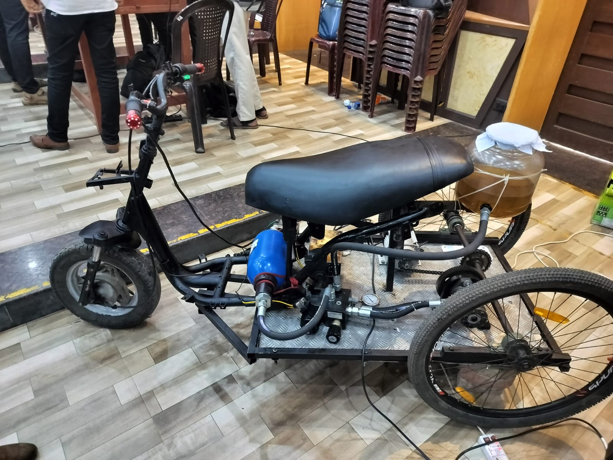

# 🚗 Hydraulic Hybrid Electric Vehicle (HHEV)

An embedded control system for a **Hydraulic Hybrid Electric Vehicle (HHEV)** that intelligently switches between **hydraulic** and **electric propulsion** using pressure-based energy management.

The project focuses on **regenerative braking**, **automatic propulsion mode switching**, and **real-time embedded control** to improve overall vehicle energy efficiency.

---

## 📸 Project Preview

<p align="center">
  
</p>

---

# 📖 Overview

The **Hydraulic Hybrid Electric Vehicle (HHEV)** project was developed as part of the **CEG Tech Forum** to demonstrate an efficient hybrid propulsion system by combining hydraulic energy storage with electric propulsion.

Unlike conventional electric vehicles, this system stores braking energy inside a **hydraulic accumulator**. An embedded controller continuously monitors the accumulator pressure using a pressure sensor and automatically switches between hydraulic and electric propulsion through a **Directional Control Valve (DCV)**.

This intelligent energy management system reduces battery usage while maximizing the utilization of recovered braking energy.

---

# ✨ Features

- Intelligent hydraulic-electric propulsion switching
- Pressure-based energy management
- Regenerative braking
- Automatic Directional Control Valve (DCV) control
- Embedded real-time control
- Hydraulic accumulator pressure monitoring
- BLDC motor control
- Battery-assisted propulsion

---

# 🎯 Objectives

- Design an intelligent embedded control system for a Hydraulic Hybrid Electric Vehicle.
- Recover braking energy using regenerative braking.
- Store recovered energy in a hydraulic accumulator.
- Continuously monitor accumulator pressure using a pressure sensor.
- Automatically switch between hydraulic and electric propulsion.
- Improve vehicle energy efficiency through optimized energy management.

---

# ⚙️ Working Principle

### Step 1 – Regenerative Braking

When the vehicle brakes, kinetic energy is converted into hydraulic energy.

Instead of wasting braking energy as heat, the hydraulic pump compresses hydraulic fluid and stores energy inside the hydraulic accumulator.

---

### Step 2 – Pressure Monitoring

A pressure sensor continuously measures the pressure inside the hydraulic accumulator.

The pressure value is sent to the embedded controller for decision-making.

---

### Step 3 – Intelligent Decision

The embedded controller compares the measured pressure with a predefined threshold.

- If the accumulator pressure is sufficiently high, the controller selects **hydraulic propulsion**.
- If the pressure falls below the threshold, the controller switches to **electric propulsion** powered by the battery.

---

### Step 4 – Automatic Mode Switching

The controller actuates the **Directional Control Valve (DCV)** to switch the propulsion path.

This automatic switching ensures efficient utilization of stored hydraulic energy while reducing battery consumption.

---

# 🔧 Hardware Components

| Component | Description |
|------------|-------------|
| Arduino | Main embedded controller |
| Pressure Sensor | Measures accumulator pressure |
| Hydraulic Accumulator | Stores recovered hydraulic energy |
| Directional Control Valve (DCV) | Switches propulsion modes |
| Solenoid Valve | Controls hydraulic flow |
| Hydraulic Motor | Provides hydraulic propulsion |
| BLDC Motor | Provides electric propulsion |
| Battery Pack | Supplies electrical energy |

---

# 💻 Software Used

- Embedded C
- Arduino IDE

---

# 👨‍💻 My Contributions

- Studied the operating principles of Hydraulic Hybrid Electric Vehicles.
- Designed the embedded control logic for automatic propulsion switching.
- Developed Embedded C firmware for the Arduino controller.
- Interfaced the pressure sensor with the embedded controller.
- Implemented pressure-based hydraulic/electric mode selection.
- Controlled the Directional Control Valve (DCV).
- Worked on BLDC motor interfacing and control.
- Assisted in battery management and solenoid valve interfacing.
- Tested and validated automatic propulsion switching.

---

# 📂 Repository Structure

```text
Hydraulic-Hybrid-Electric-Vehicle
│
├── README.md
├── Code/
├── Hydraulic_Vehicle.jpeg

```

---

# 📊 Results

The implemented system successfully demonstrates:

- ✅ Automatic hydraulic/electric propulsion switching
- ✅ Pressure-based energy management
- ✅ Embedded real-time control
- ✅ Regenerative braking implementation
- ✅ Reduced battery utilization
- ✅ Efficient hydraulic energy utilization

---

# 🚀 Future Improvements

- Migrate the controller to STM32 or ESP32.
- Implement CAN Bus communication.
- Develop an IoT-based monitoring system.
- Add battery State of Charge (SOC) estimation.
- Build a real-time dashboard for monitoring.
- Integrate wireless telemetry.
- Improve energy management using AI/ML algorithms.

---

# 📚 Applications

- Hybrid Electric Vehicles
- Automotive Embedded Systems
- Smart Mobility Solutions
- Energy-Efficient Transportation
- Industrial Hydraulic Systems
- Embedded Control Systems

---

# 🛠 Skills Demonstrated

- Embedded Systems
- Embedded C Programming
- Arduino Development
- Sensor Interfacing
- Pressure Sensor Integration
- BLDC Motor Control
- Hydraulic Control Systems
- Real-Time Embedded Programming
- Regenerative Braking
- Energy Management Systems

---

# 🎥 Project Demonstration

You can upload a demonstration video to YouTube or Google Drive and add the link here.

**Demo Video:** *(Add your project video link here)*

---

# 👤 Author

## Deena Dhayalan G K

**B.E. Electronics and Communication Engineering**

College of Engineering Guindy (Anna University)

📧 **Email:**  
dhayalandeena811@gmail.com

💼 **LinkedIn:**  
https://www.linkedin.com/in/deenadhayalangk

💻 **GitHub:**  
https://github.com/DeenaDhayalanGK

---

## ⭐ If you found this project interesting, please consider giving it a Star!
